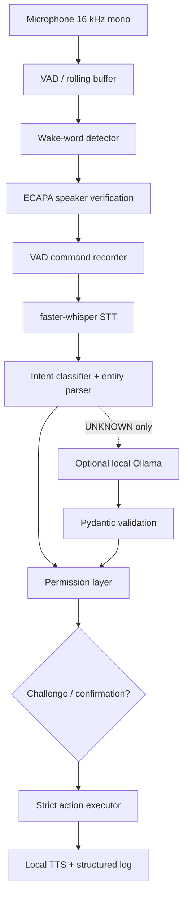
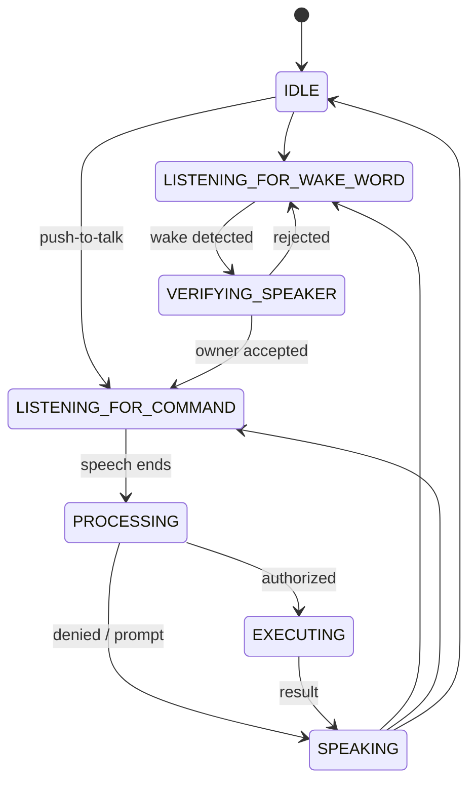
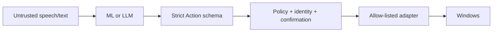

# Architecture

## Runtime states

`assistant_state.StateMachine` rejects illegal transitions and exposes a locked snapshot to the debug dashboard.

## Modules

- `audio/`: `sounddevice` stream, mono/normalization/resampling, WebRTC VAD with energy fallback, VAD-ended recording, WAV helpers.
- `wakeword/`: collection, augmentation, dataset, log-mel CNN, train/evaluate, streaming inference, and openWakeWord adapter.
- `speaker/`: enrollment, pretrained SpeechBrain ECAPA embedding extraction, four verifier approaches, evaluation, runtime scoring.
- `stt/`: waveform preparation and faster-whisper adapter. Model initialization chooses CUDA/float16 or CPU/int8 and retries CPU after CUDA startup failure.
- `intent/`: JSON dataset, Unicode character n-gram classifier, rule fallback, training and evaluation.
- `brain/`: Pydantic contracts, entity extraction, compound parsing, optional Ollama JSON adapter, permissions, confirmation, replay challenge.
- `executor/`: app/project alias resolution and a fixed action dispatch table. Platform libraries are imported only inside the actions that need them.
- `tts/`: replaceable pyttsx3/SAPI engine and voice selection.
- `main.py`: composition root and resilient user interaction loop.
- `logging_setup.py` / `dashboard.py`: JSONL telemetry and a lightweight terminal status view.

## Trust boundary

Speech, STT text, entity values, and LLM JSON are untrusted. An `Action` rejects unknown fields and unknown action types. URLs are limited to HTTP(S), apps/projects are alias-resolved from configuration, paths must exist, and subprocess calls use fixed executable/argument lists with `shell=False`. There is no general shell dispatch branch.

## Training artifacts and data flow

Wake-word audio becomes fixed two-second log-mel features for the CNN. Speaker recordings become normalized 192-dimensional ECAPA embeddings (dimension is model-dependent), then a validation comparison selects the best verifier. Intent text becomes Unicode character n-gram TF-IDF features for logistic regression. Each trainer makes a stratified split and saves metrics beneath `runs/`.

## Extension points

Add TTS engines behind a `speak(text)` interface, new STT behind `transcribe(audio, rate)`, and local language models behind `parse(text) -> ActionPlan`. New actions require a schema enum value, permission policy, executor branch, and tests. This deliberate duplication makes security review visible.

