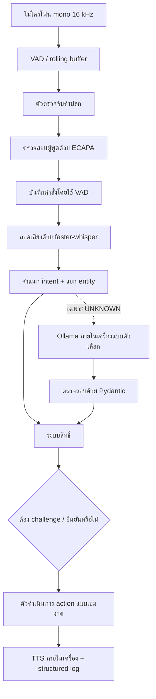
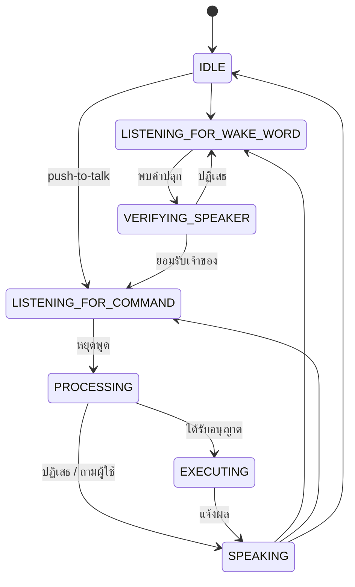
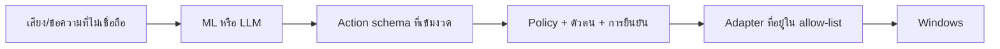

# สถาปัตยกรรมระบบ

## สถานะขณะทำงาน

`assistant_state.StateMachine` ปฏิเสธ transition ที่ไม่ถูกต้องและให้ snapshot แบบ thread-safe แก่ debug dashboard

## โมดูล

- `audio/`: stream จาก `sounddevice`, การแปลง mono/normalize/resample, WebRTC VAD พร้อม energy fallback, การหยุดบันทึกด้วย VAD และตัวช่วย WAV
- `wakeword/`: การเก็บข้อมูล augmentation, dataset, log-mel CNN, การฝึก/ประเมิน streaming inference และตัวเชื่อมต่อ openWakeWord
- `speaker/`: enrollment, การสร้าง embedding ด้วย SpeechBrain ECAPA ที่ฝึกมาแล้ว วิธีตรวจสอบผู้พูด 4 แบบ การประเมิน และ runtime scoring
- `stt/`: เตรียม waveform และเชื่อม faster-whisper ระบบเลือก CUDA/float16 หรือ CPU/int8 และลอง CPU ใหม่เมื่อเริ่ม CUDA ไม่สำเร็จ
- `intent/`: JSON dataset, Unicode character n-gram classifier, rule fallback, การฝึกและประเมิน
- `brain/`: Pydantic contract, entity extraction, compound parser, Ollama JSON adapter, permission, confirmation และ replay challenge
- `executor/`: แก้ alias ของ app/project และ dispatch table แบบคงที่ ไลบรารีเฉพาะแพลตฟอร์มจะ import เมื่อ action นั้นต้องใช้เท่านั้น
- `tts/`: pyttsx3/SAPI engine ที่เปลี่ยนแทนได้ และการเลือกเสียง
- `main.py`: จุดประกอบระบบและ loop ที่กู้คืนจากความผิดพลาดได้
- `logging_setup.py` / `dashboard.py`: telemetry แบบ JSONL และหน้าสถานะขนาดเล็กใน terminal

## ขอบเขตความเชื่อถือ

เสียง ข้อความจาก STT ค่า entity และ JSON จาก LLM ถือเป็นข้อมูลที่ไม่เชื่อถือ `Action` จะปฏิเสธฟิลด์และชนิด action ที่ไม่รู้จัก URL จำกัดเฉพาะ HTTP(S) แอปและโปรเจกต์ต้องตรงกับ alias ใน config, path ต้องมีอยู่จริง และ subprocess ใช้ executable/argument list แบบคงที่ร่วมกับ `shell=False` ระบบไม่มี branch สำหรับเรียก shell ทั่วไป

## Artifact จากการฝึกและการไหลของข้อมูล

เสียงคำปลุกจะถูกแปลงเป็น log-mel ความยาวคงที่สองวินาทีเพื่อเข้า CNN เสียงผู้พูดจะถูกแปลงเป็น normalized ECAPA embedding ซึ่งโดยทั่วไปมี 192 มิติ แต่ขึ้นกับโมเดล จากนั้น validation จะเลือก verifier ที่ดีที่สุด ข้อความ intent จะถูกแปลงเป็น Unicode character n-gram TF-IDF เพื่อเข้า Logistic Regression ตัวฝึกแต่ละตัวแบ่งข้อมูลแบบ stratified และบันทึก metric ใต้ `runs/`

## จุดสำหรับขยายระบบ

สามารถเพิ่ม TTS engine หลัง interface `speak(text)` เพิ่ม STT หลัง `transcribe(audio, rate)` และเพิ่ม local language model หลัง `parse(text) -> ActionPlan` การเพิ่ม action ใหม่ต้องเพิ่ม enum ใน schema, permission policy, executor branch และ tests การต้องแก้หลายจุดโดยตั้งใจนี้ทำให้ตรวจสอบด้านความปลอดภัยได้ชัดเจน
