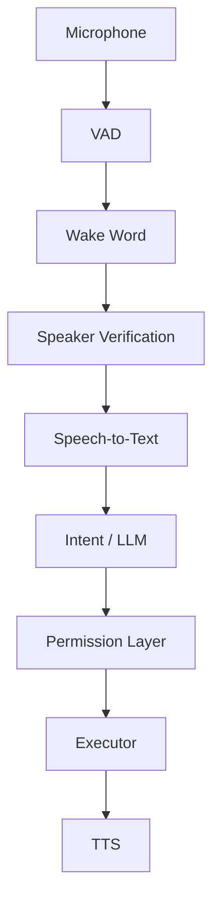

# Personal Voice AI Assistant for Windows

Build a complete **Personal Voice AI Assistant for Windows** using Python.

The assistant should work like a small personal "Jarvis": it listens for a custom wake word, verifies that the speaker is the authorized owner, converts speech to text, understands the user's intention, executes safe actions on Windows, and optionally responds using text-to-speech.

This project must include real machine-learning components that can be trained, evaluated, and used locally.

The final project must be well-structured, modular, documented, testable, and suitable for continued development.

---

# 1. Main Goal

Create a local Windows voice assistant with this pipeline:

```text
Microphone
   ↓
Voice Activity Detection
   ↓
Wake Word Detection
   ↓
Speaker Verification
   ↓
Record Command
   ↓
Speech-to-Text
   ↓
Intent Classification / LLM
   ↓
Permission & Safety Layer
   ↓
Windows Action Executor
   ↓
Text-to-Speech Response
```

Example:

```text
User:
"Hey Nova"

Assistant:
Wake word detected

Speaker verification:
Authorized owner detected

Assistant:
"ว่าไง"

User:
"เปิด Visual Studio Code แล้วเปิดโปรเจกต์ Study Platform"

Speech-to-Text:
เปิด Visual Studio Code แล้วเปิดโปรเจกต์ Study Platform

Intent Parser:
[
    {
        "action": "open_app",
        "target": "vscode"
    },
    {
        "action": "open_project",
        "target": "study-platform"
    }
]

Executor:
- Open VS Code
- Open project

Assistant:
"เปิดให้แล้ว"
```

The default assistant name / wake word should be:

```text
Hey Nova
```

but it must be configurable.

---

# 2. Technology Stack

Use primarily:

- Python 3.11 or Python 3.12
- PyTorch
- OpenCV only if useful
- NumPy
- SciPy
- scikit-learn
- librosa
- sounddevice or PyAudio
- faster-whisper
- Silero VAD or another reliable local VAD
- SpeechBrain ECAPA-TDNN for speaker embeddings
- openWakeWord OR custom PyTorch wake word model
- ONNX Runtime where useful
- pywin32
- psutil
- pyautogui
- keyboard
- pycaw
- Pydantic
- pytest

Use CUDA automatically when supported.

The project should still support CPU fallback.

Do not require paid APIs.

The base system must be able to work locally.

---

# 3. Project Structure

Use a clean structure similar to:

```text
personal-voice-ai/
│
├── main.py
├── requirements.txt
├── .env.example
├── .gitignore
│
├── config/
│   ├── settings.yaml
│   ├── apps.yaml
│   ├── permissions.yaml
│   └── projects.yaml
│
├── audio/
│   ├── microphone.py
│   ├── recorder.py
│   ├── vad.py
│   ├── preprocessing.py
│   └── utils.py
│
├── wakeword/
│   ├── collect.py
│   ├── dataset.py
│   ├── augment.py
│   ├── train.py
│   ├── evaluate.py
│   ├── inference.py
│   └── models/
│
├── speaker/
│   ├── collect.py
│   ├── embeddings.py
│   ├── dataset.py
│   ├── train.py
│   ├── evaluate.py
│   ├── verify.py
│   └── models/
│
├── stt/
│   ├── whisper.py
│   └── preprocessing.py
│
├── intent/
│   ├── dataset/
│   │   └── intents.json
│   ├── dataset.py
│   ├── train.py
│   ├── evaluate.py
│   ├── classifier.py
│   └── models/
│
├── brain/
│   ├── router.py
│   ├── parser.py
│   ├── schemas.py
│   ├── permissions.py
│   └── llm.py
│
├── executor/
│   ├── apps.py
│   ├── projects.py
│   ├── browser.py
│   ├── audio.py
│   ├── media.py
│   ├── windows.py
│   ├── system.py
│   └── executor.py
│
├── tts/
│   ├── engine.py
│   └── voices.py
│
├── data/
│   ├── wakeword/
│   │   ├── positive/
│   │   └── negative/
│   │
│   ├── speakers/
│   │   ├── owner/
│   │   └── negatives/
│   │
│   └── commands/
│
├── logs/
│
├── tests/
│
├── scripts/
│   ├── setup.ps1
│   ├── start.ps1
│   └── check_gpu.py
│
├── README.md
├── TRAINING.md
├── USAGE.md
├── ARCHITECTURE.md
└── SECURITY.md
```

You may improve this structure if needed, but keep modules clearly separated.

---

# 4. Audio Pipeline

Create a reusable microphone streaming system.

Requirements:

- Select microphone device.
- Display available input devices.
- Configurable sample rate.
- Recommended target sample rate: 16 kHz.
- Convert audio to mono.
- Normalize input audio.
- Keep a short rolling buffer.
- Detect silence.
- Detect speech.
- Automatically stop recording after the speaker stops talking.

Use Voice Activity Detection so the system does not continuously send silence into other models.

Support:

```text
IDLE
LISTENING_FOR_WAKE_WORD
VERIFYING_SPEAKER
LISTENING_FOR_COMMAND
PROCESSING
EXECUTING
SPEAKING
```

Implement this as a proper state machine.

---

# 5. Wake Word System

Create a wake-word detection module.

Default wake word:

```text
Hey Nova
```

The user must be able to change it later.

There should be two options:

## Option A

Use openWakeWord.

## Option B

Allow training a custom wake-word classifier.

Create commands/scripts for:

```bash
python -m wakeword.collect
python -m wakeword.train
python -m wakeword.evaluate
```

Wake-word dataset:

```text
data/wakeword/positive/
data/wakeword/negative/
```

Positive examples contain the target phrase.

Negative examples contain:

- regular conversation
- similar words
- background noise
- music
- keyboard noise
- YouTube audio
- microphone noise

Include audio augmentation:

- background noise
- volume changes
- pitch shifts
- time stretching
- random silence
- room noise
- reverberation

Training must save:

```text
wakeword/models/
```

Include:

- best model
- training metrics
- validation metrics
- confusion matrix
- threshold evaluation

Wake-word confidence threshold must be configurable.

Example:

```yaml
wakeword:
  phrase: "Hey Nova"
  threshold: 0.80
```

---

# 6. Speaker Verification

After detecting the wake word, verify that the voice belongs to the authorized owner.

Use a pretrained speaker embedding model such as:

```text
SpeechBrain ECAPA-TDNN
```

Do not train ECAPA-TDNN from zero unless specifically needed.

Instead:

```text
Audio
  ↓
ECAPA-TDNN
  ↓
Speaker Embedding
  ↓
Custom Classifier / Similarity Model
  ↓
AUTHORIZED / REJECTED
```

Create an owner enrollment process:

```bash
python -m speaker.collect
```

Ask the user to record multiple sentences.

Collect approximately:

```text
30-100 owner recordings
```

with different:

- speaking speeds
- microphone distances
- voice volume
- times of day
- natural phrases

Store:

```text
data/speakers/owner/
```

Negative examples:

```text
data/speakers/negatives/
```

Create:

```bash
python -m speaker.train
python -m speaker.evaluate
```

Support:

- cosine similarity
- Logistic Regression
- SVM
- small MLP

Compare approaches and use the best validation result.

Save evaluation metrics:

- accuracy
- precision
- recall
- F1
- ROC-AUC if applicable
- FAR
- FRR

Where:

```text
FAR = False Acceptance Rate
FRR = False Rejection Rate
```

Allow configuring the speaker threshold.

Example:

```yaml
speaker:
  enabled: true
  threshold: 0.78
```

Do not claim speaker verification is fully secure against replay attacks or deepfake audio.

---

# 7. Replay Protection

Add optional basic replay detection.

Possible techniques:

- detect audio coming directly from speakers
- challenge-response mode for sensitive commands
- ask the user to speak a randomly generated phrase

Example:

```text
Assistant:
"พูดคำว่า blue seven"

User:
"blue seven"
```

Sensitive commands may require this verification.

---

# 8. Speech-to-Text

Use:

```text
faster-whisper
```

Support Thai and English.

Automatically detect language or allow:

```yaml
stt:
  language: auto
```

Support configurable Whisper models:

```text
tiny
base
small
medium
large-v3
```

Recommended default:

```text
small
```

or choose a suitable model based on available GPU memory.

Automatically detect CUDA.

Example output:

```python
SpeechResult(
    text="เปิด visual studio code",
    language="th",
    confidence=0.92
)
```

---

# 9. Intent Classification

Do not rely only on keyword matching.

Create a trainable intent classification model.

Initial intents:

```text
OPEN_APP
CLOSE_APP

OPEN_PROJECT

OPEN_FOLDER

OPEN_URL
WEB_SEARCH

VOLUME_UP
VOLUME_DOWN
SET_VOLUME
MUTE
UNMUTE

MEDIA_PLAY
MEDIA_PAUSE
MEDIA_NEXT
MEDIA_PREVIOUS

SCREENSHOT

LOCK_PC

GET_TIME

GET_SYSTEM_INFO

UNKNOWN
```

Dataset format:

```json
{
  "text": "เปิด spotify ให้หน่อย",
  "intent": "OPEN_APP",
  "entities": {
    "app": "spotify"
  }
}
```

Support Thai and English.

Examples:

```text
เปิด spotify
เปิดเพลงหน่อย
เปิด vscode ให้หน่อย
launch vscode
start chrome

เสียงดังไป
ลดเสียงลงหน่อย
volume down

mute หน่อย
ปิดเสียงที

แคปหน้าจอ
ถ่าย screenshot
capture screen
```

Use sentence embeddings or another suitable NLP approach.

A suggested pipeline:

```text
Sentence
   ↓
Sentence Embedding
   ↓
Trainable Classifier
   ↓
Intent
```

Create:

```bash
python -m intent.train
python -m intent.evaluate
```

Save:

```text
intent/models/
```

Evaluation should include:

- train loss
- validation loss
- accuracy
- macro F1
- confusion matrix
- per-class metrics

---

# 10. Entity Extraction

Extract entities separately from intent.

Example:

```text
"เปิด vscode"
```

returns:

```json
{
  "intent": "OPEN_APP",
  "entities": {
    "app": "vscode"
  }
}
```

Example:

```text
"ตั้งเสียงไว้ 40 เปอร์เซ็นต์"
```

returns:

```json
{
  "intent": "SET_VOLUME",
  "entities": {
    "volume": 40
  }
}
```

Example:

```text
"ค้น google เรื่อง pytorch transformer"
```

returns:

```json
{
  "intent": "WEB_SEARCH",
  "entities": {
    "query": "pytorch transformer"
  }
}
```

---

# 11. Optional Local LLM

Design the system so a local LLM can be added.

Possible integration:

```text
Ollama
```

but do not make it mandatory.

The assistant must work without an LLM.

The LLM should be used for:

- understanding complex commands
- converting commands into structured actions
- conversational responses
- multi-step commands

Example:

```text
"เปิด vscode แล้วเปิดโปรเจกต์ study platform แล้วเปิด chrome ไป localhost 3000"
```

Expected structured result:

```json
{
  "actions": [
    {
      "type": "open_app",
      "target": "vscode"
    },
    {
      "type": "open_project",
      "target": "study-platform"
    },
    {
      "type": "open_url",
      "target": "http://localhost:3000"
    }
  ]
}
```

Use Pydantic models to validate all LLM outputs.

Never execute raw LLM output.

---

# 12. CRITICAL SECURITY REQUIREMENT

Never do:

```python
os.system(llm_response)
```

or:

```python
subprocess.run(llm_response, shell=True)
```

with untrusted AI-generated text.

All actions must pass through a strict executor.

Example:

```python
ALLOWED_ACTIONS = {
    "open_app",
    "close_app",
    "open_project",
    "open_folder",
    "open_url",
    "web_search",
    "volume_up",
    "volume_down",
    "set_volume",
    "mute",
    "unmute",
    "media_play",
    "media_pause",
    "media_next",
    "media_previous",
    "screenshot",
    "lock_pc"
}
```

The model generates structured data.

The executor decides whether the command is allowed.

---

# 13. Permission Levels

Implement action permission levels.

Example:

```text
LEVEL 0
No confirmation

volume
media
get_time
system_info
```

```text
LEVEL 1
Authorized speaker required

open_app
close_app
open_project
open_folder
open_url
web_search
screenshot
```

```text
LEVEL 2
Authorized speaker + confirmation

lock_pc
restart
shutdown
```

```text
LEVEL 3
Disabled by default

delete_file
run_shell
install_program
uninstall_program
send_message
modify_system_settings
```

Configuration:

```yaml
permissions:
  shutdown:
    enabled: true
    confirmation: true

  run_shell:
    enabled: false

  delete_file:
    enabled: false
```

---

# 14. Confirmation System

Sensitive command:

```text
User:
"ปิดเครื่อง"

Assistant:
"ต้องการปิดเครื่องใช่ไหม?"

User:
"ยืนยัน"
```

Only execute after confirmation.

Confirmation expires after a configurable timeout.

Example:

```yaml
confirmation_timeout_seconds: 10
```

---

# 15. Windows App Control

Create configurable app definitions.

Example:

```yaml
apps:
  vscode:
    aliases:
      - vscode
      - visual studio code
      - code
    path: C:\Users\User\AppData\Local\Programs\Microsoft VS Code\Code.exe

  chrome:
    aliases:
      - chrome
      - google chrome
    path: C:\Program Files\Google\Chrome\Application\chrome.exe

  spotify:
    aliases:
      - spotify
      - music
```

Do not hardcode user-specific Windows paths throughout the code.

Put them in configuration files.

---

# 16. Project Launcher

Add configurable development projects.

Example:

```yaml
projects:
  study-platform:
    aliases:
      - study platform
      - study
      - platform

    path: C:\Projects\study-platform

    editor: vscode

  portfolio:
    aliases:
      - portfolio
      - personal website

    path: C:\Projects\portfolio

    editor: vscode
```

Command:

```text
"Nova เปิดโปรเจกต์ Study Platform"
```

should execute approximately:

```bash
code C:\Projects\study-platform
```

but through a safe subprocess call, not shell injection.

---

# 17. Windows System Actions

Support:

```text
open app
close app

open folder
open project

open website
web search

volume up
volume down
set volume
mute

media play/pause
next track
previous track

screenshot

lock PC

get CPU usage
get RAM usage
get GPU information
get system uptime
```

Shutdown and restart should exist but require confirmation.

---

# 18. Text-to-Speech

Add local TTS.

Requirements:

- Thai support
- English support
- ability to enable/disable
- configurable voice
- configurable speaking rate

Example responses:

```text
"เปิดให้แล้ว"

"หาโปรแกรมนี้ไม่เจอ"

"เสียงตอนนี้อยู่ที่ 40 เปอร์เซ็นต์"

"คำสั่งนี้ต้องยืนยันก่อน"

"เสียงนี้ไม่ใช่เจ้าของเครื่อง"
```

Keep TTS modular so another model can replace it later.

---

# 19. Logging

Add structured logging.

Log:

```text
timestamp
wakeword confidence
speaker score
transcription
intent
intent confidence
action
execution result
execution duration
errors
```

Example:

```text
2026-09-11 19:45:02
WAKEWORD
confidence=0.93

2026-09-11 19:45:03
SPEAKER
authorized=true
similarity=0.88

2026-09-11 19:45:05
STT
text="เปิด vscode"

2026-09-11 19:45:05
INTENT
intent=OPEN_APP
confidence=0.97

2026-09-11 19:45:06
EXECUTOR
action=open_app
target=vscode
success=true
```

Do not log sensitive audio by default.

Audio logging must be optional.

---

# 20. CLI

Add commands such as:

```bash
python main.py
```

and:

```bash
python main.py --debug
```

and:

```bash
python main.py --no-speaker-verification
```

and:

```bash
python main.py --push-to-talk
```

Push-to-talk mode is useful for debugging without the wake-word model.

---

# 21. Debug Dashboard

Create a lightweight debugging interface.

It may be CLI/TUI or a small local web UI.

Display:

```text
State:
LISTENING

Microphone:
Microphone Array

Wake Word:
Hey Nova

Wake confidence:
0.92

Speaker:
AUTHORIZED

Speaker score:
0.87

Last transcription:
เปิด vscode

Intent:
OPEN_APP

Confidence:
0.96

Last action:
vscode opened
```

Optional but strongly recommended.

---

# 22. Model Evaluation

Every trainable component must have an evaluation script.

Do not only train models.

Wake-word evaluation:

```text
precision
recall
F1
false positive rate
false negative rate
confusion matrix
```

Speaker verification:

```text
FAR
FRR
ROC
AUC
threshold tuning
```

Intent model:

```text
accuracy
macro F1
confusion matrix
per-class report
```

Save metrics to:

```text
runs/
```

Example:

```text
runs/
├── wakeword/
├── speaker/
└── intent/
```

---

# 23. GPU Support

Create:

```bash
python scripts/check_gpu.py
```

Output example:

```text
PyTorch CUDA available: YES

GPU:
NVIDIA GeForce RTX 4050 Laptop GPU

CUDA:
12.x

Whisper device:
cuda

Speaker model:
cuda
```

If CUDA is unavailable, automatically fall back to CPU.

Do not crash because CUDA is unavailable.

---

# 24. Configuration

All major values should be configurable.

Example:

```yaml
assistant:
  name: Nova

wakeword:
  phrase: Hey Nova

  threshold: 0.80

speaker:
  enabled: true

  threshold: 0.78

stt:
  model: small

  language: auto

tts:
  enabled: true

intent:
  threshold: 0.70
```

---

# 25. Error Handling

The system must recover cleanly from:

- microphone disconnect
- STT failure
- CUDA failure
- missing application
- invalid project path
- wake word model missing
- speaker model missing
- intent model missing
- TTS failure
- malformed LLM output
- unsupported command

Do not crash the main assistant loop unnecessarily.

---

# 26. Unit Tests

Add tests for:

```text
intent parsing
entity extraction
permission system
command validation
configuration loading
app alias resolution
project alias resolution
executor validation
confirmation flow
```

Do not invoke destructive Windows commands during tests.

Mock them.

---

# 27. Development Strategy

Implement incrementally.

Recommended order:

## Phase 1

Push-to-talk prototype.

```text
Microphone
→ STT
→ Intent
→ Executor
```

Must be fully working before continuing.

## Phase 2

Add wake-word detection.

```text
Wake Word
→ STT
→ Intent
→ Executor
```

## Phase 3

Add speaker verification.

```text
Wake Word
→ Speaker Verification
→ STT
```

## Phase 4

Create and train custom intent classifier.

## Phase 5

Add TTS.

## Phase 6

Add optional local LLM.

## Phase 7

Improve security and replay protection.

Do not build all modules as placeholders.

Each phase should be functional.

---

# 28. Documentation — VERY IMPORTANT

When the project is complete, you MUST create the following Markdown documentation.

---

## README.md

Explain:

- what the project is
- architecture
- features
- supported Windows versions
- requirements
- Python version
- installation
- virtual environment
- dependencies
- CUDA setup
- microphone setup
- configuration
- basic usage
- troubleshooting

Include exact commands.

Example:

```bash
python -m venv .venv
```

Windows:

```powershell
.\.venv\Scripts\Activate.ps1
```

Then:

```bash
pip install -r requirements.txt
```

---

## TRAINING.md

This file is mandatory.

Explain EVERYTHING needed to train the project's models.

Create sections for:

### Wake Word Training

Explain:

1. how to collect samples
2. where audio is stored
3. recommended number of samples
4. positive vs negative dataset
5. augmentation
6. training command
7. evaluation command
8. output model location
9. how to change wake word
10. how to tune threshold

Example commands:

```bash
python -m wakeword.collect
```

```bash
python -m wakeword.train
```

```bash
python -m wakeword.evaluate
```

---

### Speaker Training / Enrollment

Explain:

1. how to record owner voice
2. recommended recording count
3. collecting negative samples
4. extracting embeddings
5. training classifier
6. evaluating classifier
7. FAR / FRR
8. choosing threshold
9. model location

Commands:

```bash
python -m speaker.collect
```

```bash
python -m speaker.train
```

```bash
python -m speaker.evaluate
```

---

### Intent Classification Training

Explain:

1. dataset format
2. adding a new intent
3. adding training phrases
4. entity definitions
5. starting training
6. evaluating model
7. interpreting confusion matrix
8. output model location

Commands:

```bash
python -m intent.train
```

```bash
python -m intent.evaluate
```

---

## USAGE.md

This file is mandatory.

Explain step-by-step how to actually use the assistant after training.

Include:

### First-time setup

```text
1. Install dependencies
2. Configure microphone
3. Train/enroll speaker
4. Configure applications
5. Configure projects
6. Start assistant
```

### Starting assistant

```bash
python main.py
```

### Debug mode

```bash
python main.py --debug
```

### Push-to-talk mode

```bash
python main.py --push-to-talk
```

### Example voice commands

Include at least 30 examples.

Thai examples:

```text
Hey Nova

เปิด Chrome

เปิด Visual Studio Code

เปิด Spotify

เปิดโปรเจกต์ Study Platform

ลดเสียงลงหน่อย

เพิ่มเสียง

ตั้งเสียงเป็น 50 เปอร์เซ็นต์

ปิดเสียง

เล่นเพลง

หยุดเพลง

เพลงถัดไป

แคปหน้าจอ

ค้น Google เรื่อง Next.js

ล็อกเครื่อง
```

Also include English examples.

---

## ARCHITECTURE.md

Explain the complete data flow.

Include Mermaid diagrams.

Example:



Explain each module.

---

## SECURITY.md

Explain:

- threat model
- speaker spoofing
- replay attacks
- LLM prompt injection
- command injection
- why raw shell commands are forbidden
- permission levels
- confirmation requirements
- limitations of speaker verification
- safe configuration

---

# 29. Final Developer Experience

After completing implementation, make sure a new developer can clone the project and follow only:

```text
README.md
TRAINING.md
USAGE.md
```

without needing to inspect the source code to understand how to start.

All commands in the documentation must correspond to commands that actually exist.

Do not document fake commands.

---

# 30. Final Verification

Before considering the project complete:

1. Install dependencies in a clean virtual environment.
2. Run tests.
3. Run GPU detection.
4. Verify microphone detection.
5. Test push-to-talk.
6. Test Speech-to-Text.
7. Test intent prediction.
8. Test application launching.
9. Test permission system.
10. Test confirmation workflow.
11. Test wake-word inference if model is available.
12. Test speaker verification if model is available.
13. Verify README commands.
14. Verify TRAINING.md commands.
15. Verify USAGE.md commands.
16. Ensure no destructive commands execute during tests.

Run:

```bash
pytest
```

and fix failures.

---

# 31. Code Quality

Requirements:

- Python type hints
- clear class/function naming
- modular architecture
- docstrings for complex functions
- avoid giant files
- avoid duplicated code
- Pydantic models for structured actions
- proper exception handling
- structured logging
- configuration instead of hardcoding
- async/threading only where appropriate
- graceful shutdown with Ctrl+C

Keep the audio listener responsive while expensive models are processing.

---

# 32. Important Rule for Implementation

Do not stop after generating project scaffolding.

Actually implement the functional system.

Do not leave major modules as:

```python
pass
```

or:

```text
TODO: implement later
```

unless the functionality is explicitly marked optional.

Prioritize a working end-to-end pipeline first.

If a sophisticated ML implementation is not ready yet, provide a simple working implementation first, then improve it.

The final objective is:

```text
Say wake word
      ↓
Verify owner
      ↓
Speak command
      ↓
Understand command
      ↓
Safely control Windows
      ↓
Receive voice response
```

while still providing proper model-training pipelines so the project can be expanded and improved later.
